[github](https://github.com/sanjayrohith)

> I build software, learn in public, and turn ideas into useful projects.

This is my little corner of GitHub — a place for the things I am building,
experimenting with, and improving over time.

<samp>add your languages, frameworks, and tools here</samp>

**Featured projects** 
Add the repositories and short descriptions you want visitors to discover.

Every graphic on this page is generated inside this repository. The portrait is
made locally from my own photo by [`scripts/generate_portrait.py`](scripts/generate_portrait.py),
then drawn into `ascii.svg` as an animated character grid.

The stats graphics and section headings are drawn by a [scheduled GitHub
Action](.github/workflows/stats.yml), using the GitHub GraphQL API and the
profile repository owner. The workflow runs daily and commits only files whose
content changed.

The SVGs use SMIL animation because GitHub strips scripts from READMEs. Their
JetBrains Mono font subsets are embedded directly in the files, so the page
loads without a third-party font or statistics service.

## Create your portrait

1. Add a clear, front-facing photo that you own to `portrait/source.jpg` (or use
   any local PNG/JPEG path).
2. Run `python3 scripts/generate_portrait.py portrait/source.jpg`.
3. Commit the resulting `ascii.svg`. Your source photo stays untracked.

For the best result, use a square or portrait photo with your face centered and
an uncluttered, well-lit background.
